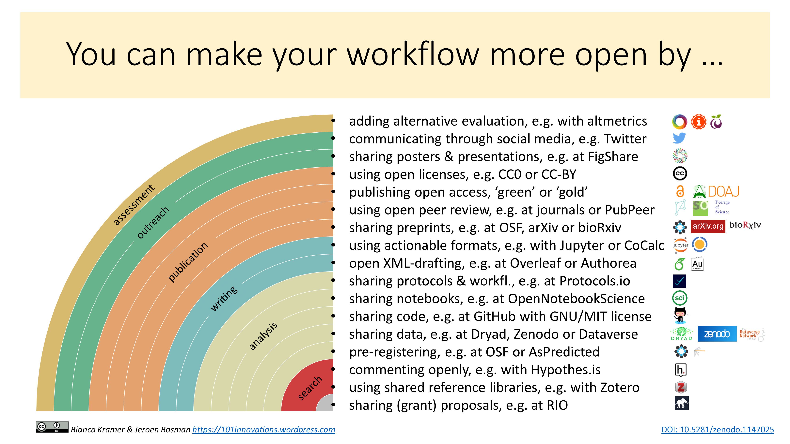

# Open Scholarship in a connected world
A seminar series held at Université Laval, winter 2019

_this repository is under construction..._

## Seminars so far

- 2019-02-27, Eve Richard & André Desrochers: Qu’est-ce que l’impact?

- 2019-02-13, Maude Laplante-Dubé: [La science ouverte: histoire, concepts de base et discussions autour d’un mouvement en effervescence](slides/H2019-SéminaireSentinelleNord_àdiffuser.pptx)
